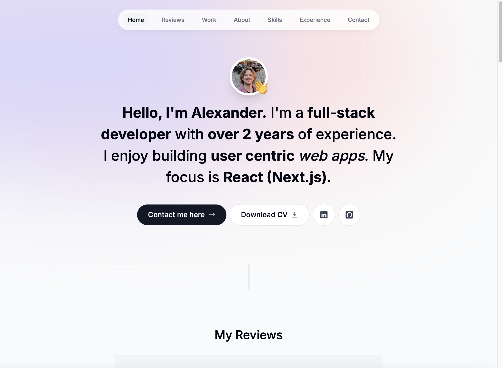

# My Modern Portfolio

<a href="https://alexanderbraatz.com" target="_blank">alexanderbraatz.com</a> is built using Next.js and supabase. It serves as my digital front page, showcasing my projects and reviews from my colleagues and clients.



## Why does this project exist?

I began this project out of a need to display my work for potential clients and employers. It soon grew into an exploration of serverless architecture simply because I was trying to make the magic link Supabase auth feature work. After testing the testimonial feature with a few people, I identified the password creation step as a key point of friction, and I wanted to address it by switching to a magic link–based auth system.

This repo also includes the use of shadcn/ui components, which I also enjoyed working with. While they were a time-saver when taking into account accessibility and cross-browser compatibility, the fine-tuning of styles to match the rest of my app (which wasbuilt without using shadcn) took a long time.

The project was driven by three primary goals:

- **Developing a Modern, User-Friendly Showcase of my work** <br/>The aim was to create an engaging online platform to exhibit my projects.
- **Displaying my endorsments fom Peers and creating a seamless review submission process** <br/>A key requirement was to build out the features of a CRUD app for my testimonials

The greatest challenge of the project was that I didn’t know what I didn’t know when I set out to enable magic links for user authentication, or how many other steps making this production-grade would involve.

1.  Setting up a custom SMTP server and verifying my own DNS records, for example, was one task.
2.  Setting up Supabase edge functions to send the emails was another.

I ultimately sketched out the flow of data in this document. This document is arguably too complex and information-rich to be useful to anyone who isn’t involved with the tech stack, but it helped me understand why what I had built was working.


## What is it made of?

### User Interface Features

- Fully mobile responsive
- dynamic navigation bar
- shadcn UI Reviews Carousel-slider
- sign In form
- invalid magic link page
- valid magic link redirect
- middleware protecting authenticated user only routes
- gallery of my work
- external component used for my experience time line
- contact form

### Technologies

- TypeScript
- JavaScript
- React
- Next.js
- Server Actions & App Router
- Supabase Auth & Database Management
- Framer Motion
- Resend
- React-Email
- Tailwind
- JSX
- HTML
- CSS
- Vercel
- Git

## 🚀 Quick Start Guide

Follow these steps to quickly set up and run the Frontend of alexanderbraatz.com on your local machine.

### Prerequisites

Ensure you have the following installed:

- Node.js
- npm
- Git

### Installation

**Clone the Repository**

- Open your terminal.
- Clone the repository using Git:

  ```
  git clone https://github.com/AlexanderBraatz/Portfolio_25.git portfolio-25-fork
  ```

- Navigate to the project directory:

  ```
  cd portfolio-25-fork
  ```

**Install Dependencies**

- Inside the project directory, run the following command to install the necessary dependencies:

  ```
  npm install
  ```

**Run the Application**

- Once the installation is complete, start the app by running:

  ```
  npm run dev
  ```

- This will launch the app in development mode.
- Open [http://localhost:3000](http://localhost:3000) to view it in the browser.

Now, you should see the portfolio-25-fork running locally on your machine, keeping in mind that the testimonial feature will not work without connecting your fork to a copy of my backend infrastructure. Please go to <a href="https://alexanderbraatz.com" target="_blank">alexanderbraatz.com</a> to see those features in action.

This is a [Next.js](https://nextjs.org/) project bootstrapped with [`create-next-app`](https://github.com/vercel/next.js/tree/canary/packages/create-next-app).
